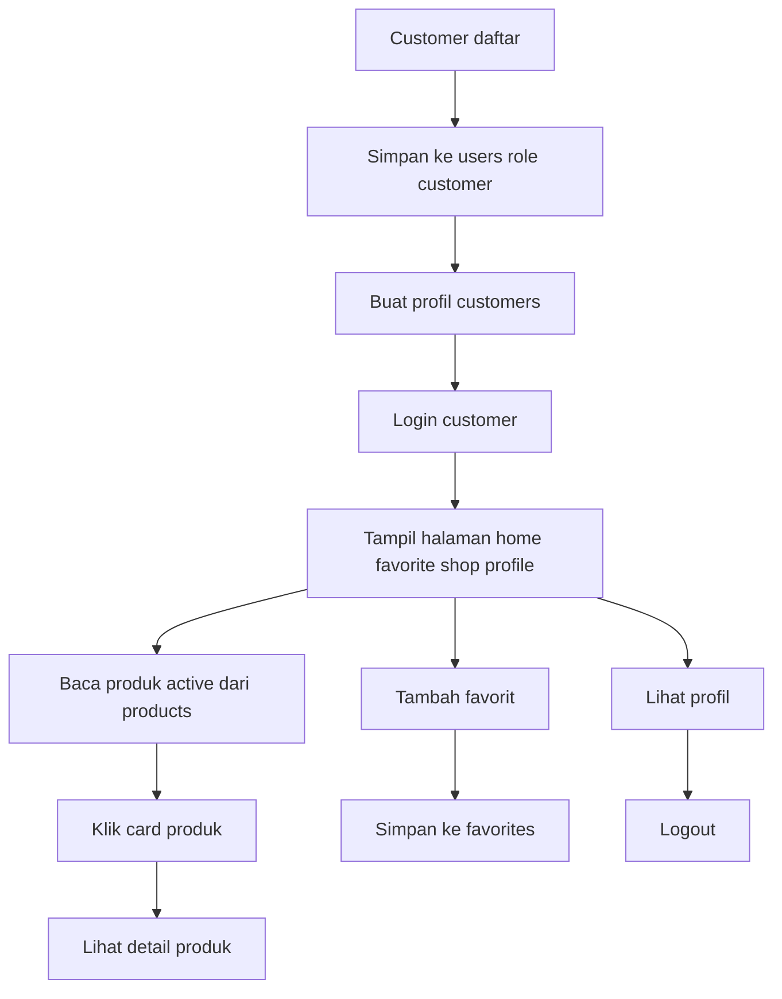
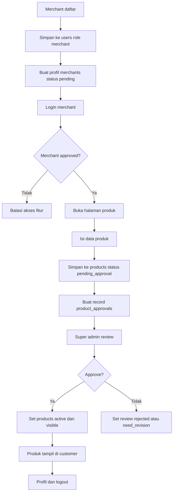
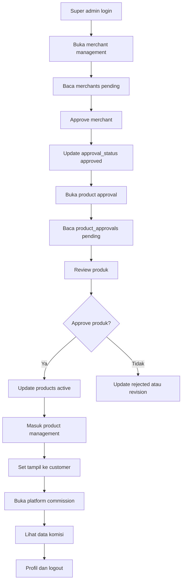

# Struktur Database MenuSisa

Dokumen ini fokus ke alur yang dipakai fitur yang kamu batasi:
- Customer: daftar, login, lihat produk, lihat detail, favorit, profil, logout.
- Merchant: daftar, login, tunggu approve, tambah produk, kirim ke approval, profil, logout.
- Super admin: approve merchant, approve produk, aktifkan/tampilkan produk, kelola commission, profil, logout.

## 1) Gambaran Besar

Database dibuat supaya 3 role punya jalur data yang jelas:
- `users` simpan akun login dan role.
- `customers` simpan profil customer.
- `merchants` simpan profil merchant dan status approval.
- `products` simpan data produk merchant dan status tampil.
- `product_approvals` simpan antrian review produk oleh super admin.
- `favorites` simpan produk favorit customer.
- `platform_commissions` simpan komisi platform dari produk atau transaksi non-checkout bila nanti dipakai.
- `activity_logs` simpan jejak aksi penting.

Kalau nanti sistem berkembang ke checkout, payment, dan order, tabel baru bisa ditambah tanpa ganggu struktur inti ini.

---

## 2) Daftar Tabel

### 2.1 `users`
**Fungsi**: pusat akun login semua role.

**Field penting**:
- `id` UUID, primary key.
- `full_name` nama user.
- `email` email unik.
- `password_hash` password terenkripsi.
- `role` nilai `customer`, `merchant`, `super_admin`.
- `is_active` status akun aktif atau nonaktif.
- `created_at`, `updated_at` timestamp audit.

**Penjelasan**:
Tabel ini jadi root account. Satu akun hanya punya satu role utama. Saat login, sistem baca `role` untuk arahkan ke halaman yang sesuai.

---

### 2.2 `customers`
**Fungsi**: profil customer pembeli.

**Field penting**:
- `id` UUID, primary key.
- `user_id` FK ke `users.id`.
- `customer_code` kode customer unik.
- `phone` nomor telepon.
- `avatar_url` foto profil.
- `address` alamat opsional.
- `created_at`, `updated_at`.

**Penjelasan**:
Tabel ini simpan data profil customer yang tampil di halaman profil. Customer tidak punya data order, cart, atau payment dalam batasan ini.

---

### 2.3 `merchants`
**Fungsi**: profil merchant dan status approval toko.

**Field penting**:
- `id` UUID, primary key.
- `user_id` FK ke `users.id`.
- `merchant_code` kode merchant unik.
- `shop_name` nama toko.
- `owner_name` nama pemilik.
- `phone` nomor kontak.
- `address` alamat toko.
- `approval_status` nilai `pending`, `approved`, `rejected`, `suspended`.
- `approved_by` FK ke `users.id` super admin.
- `approved_at` timestamp approve.
- `created_at`, `updated_at`.

**Penjelasan**:
Merchant daftar dulu, lalu status awal `pending`. Super admin cek di merchant management. Kalau `approved`, merchant boleh pakai fitur tambah produk.

---

### 2.4 `products`
**Fungsi**: data produk final yang boleh muncul ke customer.

**Field penting**:
- `id` UUID, primary key.
- `merchant_id` FK ke `merchants.id`.
- `product_code` kode produk unik.
- `name` nama produk.
- `description` deskripsi produk.
- `category` kategori.
- `price` harga.
- `stock` stok.
- `unit` satuan.
- `image_url` gambar produk.
- `status` nilai `draft`, `pending_approval`, `approved`, `active`, `inactive`, `rejected`.
- `is_visible_to_customer` boolean tampil ke customer.
- `created_at`, `updated_at`.

**Penjelasan**:
Merchant isi data produk lalu simpan. Data bisa masuk status `pending_approval` atau tersimpan dulu sebagai draft. Setelah approve super admin, status naik jadi `approved` lalu `active` supaya muncul di card customer.

---

### 2.5 `product_approvals`
**Fungsi**: antrian review produk oleh super admin.

**Field penting**:
- `id` UUID, primary key.
- `product_id` FK ke `products.id`.
- `merchant_id` FK ke `merchants.id`.
- `submitted_by` FK ke `users.id` merchant.
- `reviewed_by` FK ke `users.id` super admin.
- `review_status` nilai `pending`, `approved`, `rejected`, `need_revision`.
- `review_notes` catatan admin.
- `submitted_at` timestamp kirim.
- `reviewed_at` timestamp review.
- `created_at`, `updated_at`.

**Penjelasan**:
Tabel ini memisahkan proses input merchant dari proses validasi admin. Cocok untuk halaman product approval dan product management.

---

### 2.6 `favorites`
**Fungsi**: simpan produk favorit customer.

**Field penting**:
- `id` UUID, primary key.
- `customer_id` FK ke `customers.id`.
- `product_id` FK ke `products.id`.
- `created_at` timestamp tambah favorit.

**Penjelasan**:
Customer tekan card produk lalu tambah favorit. Data ini dipakai di halaman navigasi favorit. Satu customer boleh punya banyak favorit, satu produk bisa difavoritkan banyak customer.

---

### 2.7 `platform_commissions`
**Fungsi**: catat komisi platform per produk atau per event bisnis.

**Field penting**:
- `id` UUID, primary key.
- `merchant_id` FK ke `merchants.id`.
- `product_id` FK ke `products.id`.
- `commission_type` misal `product_fee`, `listing_fee`, `manual_adjustment`.
- `commission_rate` persen komisi.
- `commission_rate` persen komisi.
- `amount` nilai komisi.
- `status` nilai `calculated`, `confirmed`, `paid`, `void`.
- `commission_period` periode hitung.
- `created_at`, `updated_at`.
**Penjelasan**:
Karena kamu minta halaman platform commission di super admin, tabel ini simpan hasil perhitungan komisi. Kalau nanti belum dipakai hitung otomatis, tetap bisa isi manual dari admin.

---

### 2.8 `activity_logs`
**Fungsi**: jejak aksi penting semua role.

**Field penting**:
- `id` UUID, primary key.
- `user_id` FK ke `users.id`.
- `role` role pelaku.
- `action` nama aksi.
- `entity_type` misal `merchant`, `product`, `favorite`.
- `entity_id` ID data terkait.
- `description` detail aksi.
- `created_at` timestamp.

**Penjelasan**:
Dipakai buat audit. Contoh: merchant submit produk, super admin approve merchant, customer simpan favorit.

---

## 3) Relasi Utama

### Relasi inti
- `users (1) -> (1) customers`
  - satu akun customer punya satu profil customer.
- `users (1) -> (1) merchants`
  - satu akun merchant punya satu profil merchant.
- `users (1) -> (many) activity_logs`
  - satu akun bisa punya banyak log.
- `users (1) -> (many) product_approvals` via `submitted_by` dan `reviewed_by`
  - merchant kirim produk, super admin review.
- `merchants (1) -> (many) products`
  - satu merchant bisa punya banyak produk.
- `products (1) -> (many) product_approvals`
  - satu produk bisa punya riwayat review.
- `customers (1) -> (many) favorites`
  - satu customer bisa simpan banyak favorit.
- `products (1) -> (many) favorites`
  - satu produk bisa difavoritkan banyak customer.
- `merchants (1) -> (many) platform_commissions`
  - satu merchant punya banyak catatan komisi.
- `products (1) -> (many) platform_commissions`
  - komisi bisa ditautkan ke produk tertentu.

### Arah data
- Merchant isi produk -> `products`.
- Saat submit -> `product_approvals`.
- Super admin approve -> update `product_approvals` dan `products`.
- Produk aktif -> tampil ke customer page.
- Customer favorit -> `favorites`.
- Aksi penting -> `activity_logs`.

---

## 4) Alur Simpan Data

### 4.1 Alur customer
1. Customer daftar -> data masuk ke `users` dengan role `customer`.
2. Profil customer dibuat -> data masuk ke `customers`.
3. Customer login -> sistem baca role.
4. Customer buka home, favorite, shop, detail produk -> data dibaca dari `products` yang statusnya `active` dan `is_visible_to_customer = true`.
5. Customer klik favorit -> data simpan ke `favorites`.
6. Customer lihat profil -> data baca dari `customers` dan `users`.
7. Customer logout -> tidak ada perubahan database, kecuali log bila perlu.

**Batasan**:
- Tidak ada cart.
- Tidak ada checkout.
- Tidak ada payment gateway.
- Tidak ada order table dalam alur ini.

---

### 4.2 Alur merchant
1. Merchant daftar -> data masuk ke `users` role `merchant`.
2. Profil merchant dibuat -> data masuk ke `merchants` status `pending`.
3. Merchant login ke dashboard -> jika status belum `approved`, fitur dibatasi.
4. Merchant isi produk -> data masuk ke `products` status `draft` atau `pending_approval`.
5. Saat simpan, sistem buat data review -> masuk ke `product_approvals` status `pending`.
6. Super admin review -> jika approve, update `product_approvals.review_status = approved`.
7. Produk diaktifkan -> update `products.status = active` dan `is_visible_to_customer = true`.
8. Produk tampil di customer page.
9. Merchant bisa lihat profil dan logout.

**Batasan**:
- Merchant tidak boleh jual sampai merchant diset approve.
- Merchant tidak masuk ke fitur checkout, order, atau payment.

---

### 4.3 Alur super admin
1. Super admin login -> data baca dari `users` role `super_admin`.
2. Buka merchant management -> baca `merchants` dengan `approval_status = pending`.
3. Approve merchant -> update `merchants.approval_status = approved` dan isi `approved_by`, `approved_at`.
4. Buka product approval -> baca `product_approvals` status `pending`.
5. Review produk merchant -> update `product_approvals.review_status`.
6. Jika approve, update `products.status = approved` lalu `active`.
7. Jika perlu tampil ke customer, set `is_visible_to_customer = true`.
8. Buka platform commission -> baca `platform_commissions`.
9. Super admin lihat profil dan logout.

---

## 5) Flowchart

### 5.1 Flowchart Customer

### 5.2 Flowchart Merchant

### 5.3 Flowchart Super Admin

---

## 6) Rekomendasi Struktur Field Status

Pakai status konsisten biar query gampang:
- Merchant: `pending`, `approved`, `rejected`, `suspended`
- Product approval: `pending`, `approved`, `rejected`, `need_revision`
- Product: `draft`, `pending_approval`, `approved`, `active`, `inactive`, `rejected`
- Favorite: tanpa status
- Commission: `calculated`, `confirmed`, `paid`, `void`

---

## 7) Catatan Implementasi

- `users` jadi sumber utama login.
- `merchants.approval_status` wajib dicek sebelum merchant masuk fitur produk.
- `products.status` dan `is_visible_to_customer` wajib dicek sebelum produk muncul di card customer.
- `favorites` cukup untuk fitur favorit, tanpa cart.
- `product_approvals` dipakai untuk alur review supaya approval trail rapi.
- `activity_logs` penting untuk audit dan histori aksi admin.

---

## 8) Ringkasan Singkat

Inti database MenuSisa untuk scope kamu:
- akun login di `users`
- profil customer di `customers`
- profil merchant di `merchants`
- produk di `products`
- antrian approval di `product_approvals`
- favorit di `favorites`
- komisi di `platform_commissions`
- audit di `activity_logs`

Dengan struktur ini, customer cuma lihat dan simpan favorit, merchant cuma kirim produk, super admin pegang approval dan publish data.
